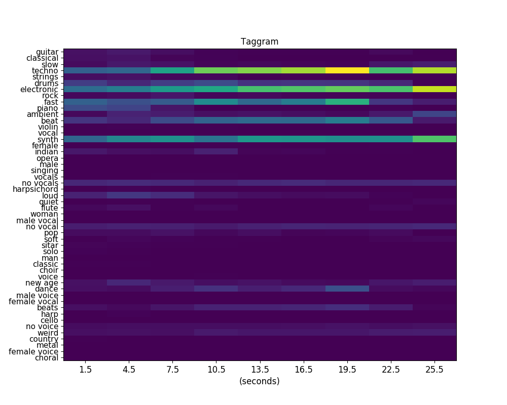

# musicnn_keras
`Musicnn_keras` is a tf.keras implementation of [musicnn](https://github.com/jordipons/musicnn), originally written in "pure" TensorFlow. 
`Musicnn_keras` is aimed at making musicnn accessible via the popular tf.keras interface. 


Pronounced as "musician", `musicnn` is a set of pre-trained musically motivated convolutional neural networks for music audio tagging. This repository also includes some pre-trained [vgg-like](https://github.com/Quint-e/musicnn_keras/blob/master/vgg_example.ipynb) baselines.

Check the [documentation](https://github.com/Quint-e/musicnn_keras/blob/master/DOCUMENTATION.md) and our [basic](https://github.com/Quint-e/musicnn_keras/blob/master/tagging_example.ipynb) / [advanced](https://github.com/Quint-e/musicnn_keras/blob/master/musicnn_example.ipynb) examples to understand how to use `musicnn`.

Do you have questions? Check the [FAQs](https://github.com/Quint-e/musicnn_keras/blob/master/FAQs.md).


## Installation

`pip install musicnn_keras`


Or clone the repository and install from source: 

``` git clone https://github.com/Quint-e/musicnn_keras/musicnn_keras.git```

``` python setup.py install```

Dependencies:  `Tensorflow>=2.0`, `librosa>=0.7.0` and `numpy<1.17,>=1.14.5`. 

## Load pre-trained models
Pre-trained models are available in `musicnn_keras/keras_checkpoints/`

Loading pre-trained model is simply achieved by using the dedicated tf.keras API: 

~~~~python
import tensorflow as tf
musicnn = tf.keras.models.load_model('./musicnn_keras/keras_checkpoints/MSD_musicnn.h5')
~~~~

`musicnn` can then be used like any other [keras model](https://www.tensorflow.org/api_docs/python/tf/keras/Model). 

Note that if you are only interested in loading the pre-trained models in your code, you do not need to install the `musicnn_keras` package. `tf.keras.models.load_model` is sufficient. 

## Transfer Learning
One may want to access intermediate layers of the models, for extracting features and/or transfer learning applications. 
This is easily achieved in python by creating a truncated model.

For example, truncating at the penultimate layer of musicnn:
~~~~python
import tensorflow as tf
keras_model = tf.keras.models.load_model('./musicnn_keras/keras_checkpoints/MSD_musicnn.h5')
truncated_model = tf.keras.Model(keras_model.input,keras_model.get_layer('bn_dense').output)
~~~~

Or the output of the max-pooling of the 3rd layer of a vgg model:
~~~~python
import tensorflow as tf
keras_model = tf.keras.models.load_model('./musicnn_keras/keras_checkpoints/MSD_vgg.h5')
truncated_model = tf.keras.Model(keras_model.input,keras_model.get_layer('pool3').output)
~~~~

The `truncated_model` can then be used as any other tf.keras model, for example using `truncated_model.predict()` to get features.

One may also want to add new, "fresh" layer(s) to the truncated model. Again, this can be achieved with the usual keras Model api. 
For example, adding a dense layer with 200 units at the top of the truncated model:
~~~~python
input_layer = tf.keras.Input(shape=input_shape)
x = truncated_model(input_layer)
x = tf.keras.layers.Dense(units=200,activation=tf.nn.relu)(x)
new_model = tf.keras.Model(input_layer, x)
~~~~

Again, `new_model` can then be used like any other tf.keras model. For example using `new_model.fit()` to train on new data. 


## Predict tags

From within **python**, you can estimate the topN tags:
~~~~python
from musicnn_keras.tagger import top_tags
top_tags('./audio/joram-moments_of_clarity-08-solipsism-59-88.mp3', model='MTT_musicnn', topN=10)
~~~~
>['techno', 'electronic', 'synth', 'fast', 'beat', 'drums', 'no vocals', 'no vocal', 'dance', 'beats']

Let's try another song!

~~~~python
top_tags('./audio/TRWJAZW128F42760DD_test.mp3')
~~~~
>['guitar', 'piano', 'fast']

From the **command-line**, you can also print the topN tags on the screen:

~~~~
python -m musicnn_keras.tagger file_name.ogg --print
python -m musicnn_keras.tagger file_name.au --model 'MSD_musicnn' --topN 3 --length 3 --overlap 1.5 --print
~~~~~

or save to a file:

~~~~
python -m musicnn_keras.tagger file_name.wav --save out.tags
python -m musicnn_keras.tagger file_name.mp3 --model 'MTT_musicnn' --topN 10 --length 3 --overlap 1 --print --save out.tags
~~~~

## Extract the Taggram

You can also compute the taggram using **python** (see our [basic](https://github.com/Quint-e/musicnn_keras/blob/master/tagging_example.ipynb) example for more details on how to depict it):

~~~~python
from musicnn_keras.extractor import extractor
taggram, tags = extractor('./audio/joram-moments_of_clarity-08-solipsism-59-88.mp3', model='MTT_musicnn')
~~~~


The above analyzed music clips are included in the `./audio/` folder of this repository. 


## musicnn_keras and musicnn
This repo mirrors the contents of the original musicnn repository, adapted to tf.keras. As a result, some of the code and examples used in this repository came from the [original musicnn repo](https://github.com/jordipons/musicnn). 
